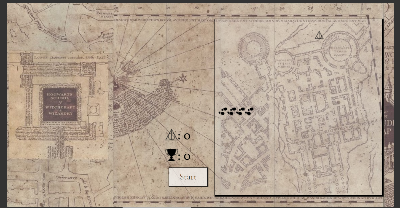

# Maurader's Map
## A snake game written in HTML, CSS, and Javascript

Try it out [here]()

### Summary 
Navigate around the Marauder's map in this snake-like game! You can move the footprints around the board with your arrow keys to catch the 'Deathly Hallows', each time you catch one you will gain 1 point but the footprints will increase in length. Catch as many as you can before you hit the wall or the footprints run into each other, once you do the game ends. Still think you can do better? Try again! The game will track your high score so you can try to beat it!

### Author
Rheanna Pena - [LinkedIn](https://www.linkedin.com/in/rheanna-gallego-aa0007110/)
